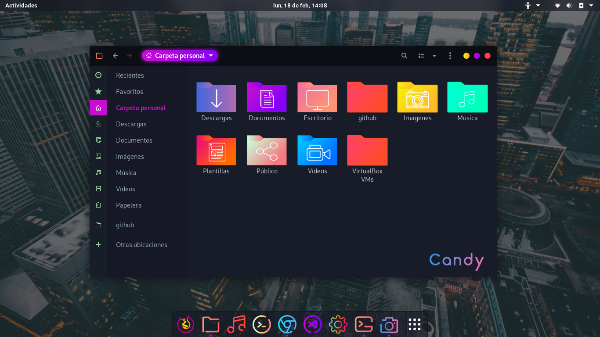

# Sweet Icon Theme
Folder icons from the [Sweet GTK Theme](https://www.opendesktop.org/s/Gnome/p/1253385/) for Linux desktop environments.




## Important
This repo only contains the folders icons, to compliment an existing icon theme.

To combine Sweet Folder icons with another theme, simply edit the `index.theme` file and define the "inherits" key with your favorite icon theme.

1. Download the folder theme of your choice, from this Github repo or [Open Desktop](https://www.opendesktop.org/p/1284047#files-panel)

2. Install and unzip to your desktop environment, most commonly `~/.local/share/icons/` or `/home/your_user/share/icons/`

3. Inside the folder directory, for example: **candy** you will find an `index.theme` file, open it with your favorite text editor

4. Find the **Inherits:** line and pre-pend your desired icon theme to accompany your new Sweet Folders icon theme (if you're unsure, open Gnome's Tweak Tool -> Appearance -> Icons) - for the sake of this example I will use the **breeze-extra-gnome** icon theme.  Change Inherits from:
```bash
Inherits=Pop,Zafiro-icons,gnome,ubuntu-mono-dark,Mint-X,elementary,gnome,hicolor
```
To:
```bash
Inherits=breeze-extra-gnome,Pop,Zafiro-icons,gnome,ubuntu-mono-dark,Mint-X,elementary,gnome,hicolor
```
5. Set your new Sweet Folder Icons theme as your primary icon set and it should automatically load.
